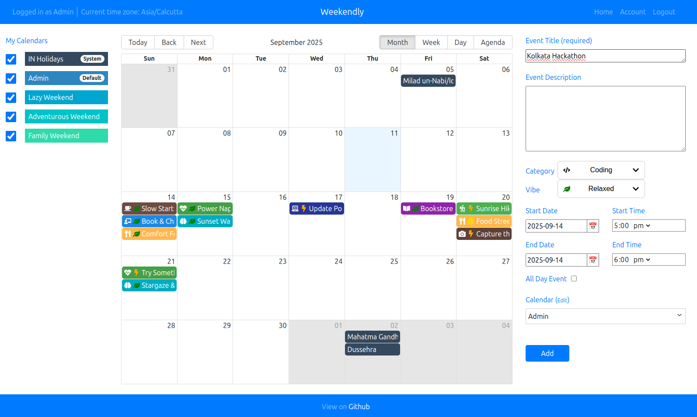
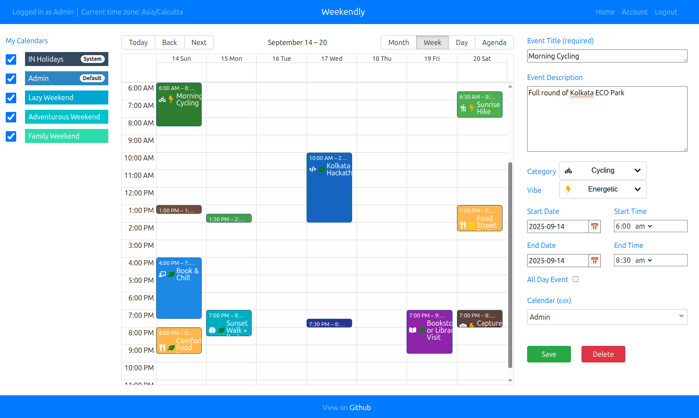
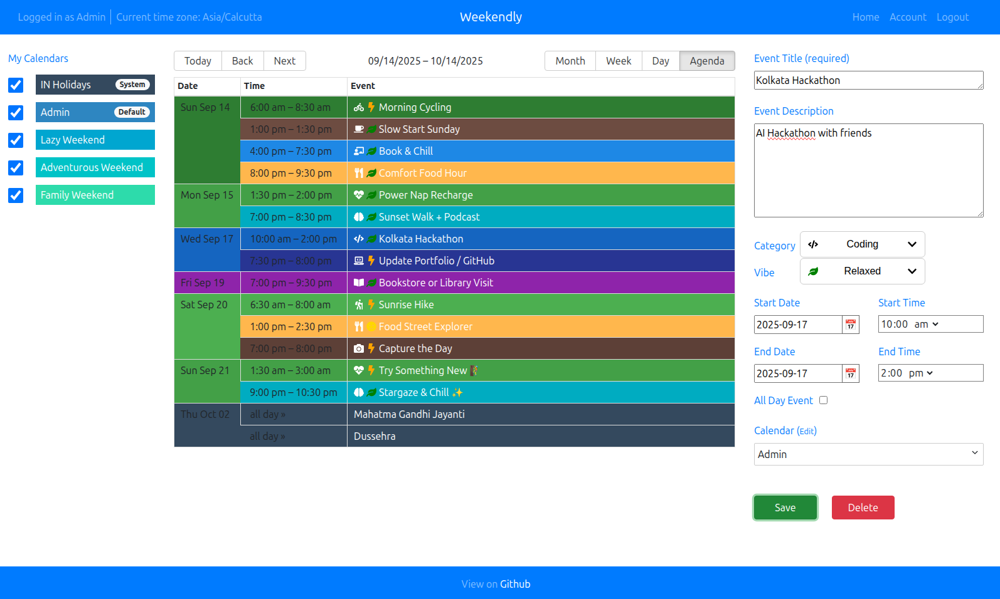

# 📅 React Calendar

> A modern, full-stack calendar application built with the MERN stack and React Big Calendar

<div align="center">
  
  
  
  [](https://nodejs.org/)
  [](https://www.mongodb.com/)
  [](https://reactjs.org/)
  [](LICENSE)
  
</div>

## ✨ Features

-   🗓️ **Multiple View Modes**: Month, Week, and Agenda views for optimal event visualization
-   🎨 **Modern UI**: Sleek interface built with React Big Calendar
-   🔐 **JWT Authentication**: Secure user authentication with role-based access control
-   🌐 **Holiday Integration**: Automatic holiday events via Calendarific API
-   📱 **Responsive Design**: Seamless experience across desktop, tablet, and mobile devices
-   🔄 **Real-time Updates**: Hot module reloading for enhanced development experience
-   💾 **Persistent Storage**: MongoDB database with Redux state management
-   ⚡ **Performance Optimized**: Efficient rendering and state management

## 🖼️ Screenshots

<div align="center">
  
  ### Month View
  
  
  ### Week View  
  
  
  ### Agenda View
  
  
</div>

## 🏗️ Tech Stack

**Frontend:**

-   ⚛️ React 18+ with React Router for navigation
-   🎨 CSS Modules for component-scoped styling
-   🗂️ Redux for centralized state management
-   📅 React Big Calendar for calendar functionality

**Backend:**

-   🟢 Node.js & Express.js RESTful API
-   🍃 MongoDB with Mongoose ODM
-   🔑 JSON Web Token (JWT) authentication & authorization
-   🌐 Calendarific API for holiday data integration

**Development & Build Tools:**

-   📦 Webpack for module bundling and optimization
-   🔥 Hot Module Reloading for development efficiency
-   🧹 Prettier & ESLint for code quality and consistency

## 🚀 Quick Start

### Prerequisites

Ensure you have the following installed on your system:

-   **Node.js** (version 16 or higher)
-   **MongoDB** (version 4.4.6 or higher)
-   **Calendarific API key** ([Get your free API key](https://calendarific.com/))

### Installation

1. **Clone the repository**

    ```bash
    git clone https://github.com/learner-enthusiast/react-calendar.git
    cd react-calendar
    ```

2. **Install dependencies**

    ```bash
    npm install
    ```

3. **Configure environment variables**

    Create `.env.development` and `.env.production` files in the root directory:

    ```env
    # Server Configuration
    PORT=3001

    # MongoDB Configuration
    MONGO_HOSTNAME=localhost
    MONGO_PORT=27017
    MONGO_DB=reactcalendar_db_name
    MONGO_URI=your_mongodb_atlas_url_here  # Optional: for MongoDB Atlas

    # API Configuration
    API_URL=http://localhost:3001/api/v1
    CALENDARIFIC_KEY=your_calendarific_api_key_here

    # JWT Configuration
    JWT_SECRET_KEY=your_secure_secret_key_here
    JWT_EXPIRATION=86400        # 24 hours
    JWT_REFRESH_EXPIRATION=604800   # 7 days
    ```

4. **Set up MongoDB**

    **For local MongoDB:**

    ```bash
    # Start MongoDB service
    mongod

    # Create database (in MongoDB shell)
    mongo
    use reactcalendar_db
    db.app.insert({ _id: 1, message: 'Database initialized' })
    ```

    **For MongoDB Atlas:** Update the `MONGO_URI` in your environment file with your Atlas connection string.

5. **Seed the database with holiday data**

    ```bash
    node seedHolidayEvents.js
    ```

6. **Start the application**

    **Development mode:**

    ```bash
    npm run dev
    ```

    This starts both the client and server with hot reloading enabled.

    **Production mode:**

    ```bash
    npm run build
    npm start
    ```

7. **Access the application**

    Open your browser and navigate to `http://localhost:8081` 🎉

## 📁 Project Structure

```
src/
├── client/                 # Frontend React application
│   ├── assets/            # Static images and resources
│   ├── components/        # Reusable React components
│   ├── pages/            # Page-level components
│   ├── store/            # Redux store configuration and actions
│   ├── styles/           # CSS modules and global styles
│   └── utils/            # Frontend utility functions
├── server/                # Backend Express application
│   ├── controllers/       # Express route handlers
│   ├── db/               # Database connection and configuration
│   ├── middleware/       # Custom Express middleware
│   ├── models/           # MongoDB/Mongoose data models
│   ├── routers/          # API route definitions
│   ├── services/         # Business logic and external API services
│   └── utils/            # Backend utility functions
├── config/               # Application configuration files
└── public/               # Static public assets
```

## 🔐 Authentication & Authorization

React Calendar implements a robust JWT-based authentication system with role-based access control:

### User Roles

-   👤 **User**: Basic calendar functionality and personal event management
-   🛡️ **Moderator**: Enhanced permissions for content moderation
-   👑 **Admin**: Full system access and user management

### Security Features

-   Secure token-based authentication
-   Automatic token refresh mechanism
-   Protected routes with role-based access control
-   Password encryption and validation
-   Session management with secure HTTP-only cookies

## 🎨 Styling Architecture

The application uses **CSS Modules** for maintainable and scalable styling:

### Benefits

-   ✅ **No naming conflicts**: Locally scoped CSS class names
-   ✅ **Explicit dependencies**: Clear component-style relationships
-   ✅ **Better maintainability**: Easier to refactor and update styles
-   ✅ **Performance**: Optimized CSS bundling and loading

### Usage Example

```javascript
import styles from './Component.module.css';

function Component() {
    return <div className={styles.container}>Content</div>;
}
```

## 🚀 Deployment

### Development Environment

```bash
npm run dev
```

Features hot module replacement, source maps, and development optimizations.

### Production Deployment

**Frontend (Netlify):**

```bash
npm run build:client
```

The build includes `_redirects` file and `netlify.toml` configuration for SPA routing.

**Backend (Render/Heroku):**

```bash
# Build command
npm install && npm run build:server

# Start command
npm run start
```

### Recommended Deployment Platforms

**Frontend:**

-   Netlify (recommended for static hosting)
-   Vercel
-   GitHub Pages

**Backend:**

-   Render (recommended for Node.js apps)
-   Heroku
-   Railway
-   DigitalOcean App Platform

**Database:**

-   MongoDB Atlas (recommended)
-   AWS DocumentDB
-   Self-hosted MongoDB

## 📊 Performance Considerations

-   **Code Splitting**: Implemented for optimal bundle sizes
-   **Lazy Loading**: Components loaded on demand
-   **Memoization**: React.memo and useMemo for expensive operations
-   **Database Indexing**: Optimized MongoDB queries
-   **Caching**: API response caching for better performance

## 🧪 Testing

```bash
# Run all tests
npm test

# Run tests with coverage
npm run test:coverage

# Run tests in watch mode
npm run test:watch
```

## 🔧 Available Scripts

```bash
npm run dev          # Start development server
npm run build        # Build for production
npm run start        # Start production server
npm run build:client # Build client only
npm run build:server # Build server only
npm run lint         # Run ESLint
npm run format       # Format code with Prettier
npm test            # Run tests
```

## 🤝 Contributing

We welcome contributions from the community! Here's how to get started:

### Development Setup

1. Fork the repository
2. Clone your fork: `git clone https://github.com/your-username/react-calendar.git`
3. Create a feature branch: `git checkout -b feature/amazing-feature`
4. Make your changes and test thoroughly
5. Commit your changes: `git commit -m 'Add amazing feature'`
6. Push to your branch: `git push origin feature/amazing-feature`
7. Submit a Pull Request

### Contribution Guidelines

-   Follow the existing code style and conventions
-   Write clear, descriptive commit messages
-   Include tests for new features
-   Update documentation as needed
-   Ensure all tests pass before submitting

## 📝 License

This project is licensed under the MIT License. See the [LICENSE](LICENSE) file for details.

## 🙏 Acknowledgments

Special thanks to:

-   [React Big Calendar](https://jquense.github.io/react-big-calendar/) - Excellent calendar component
-   [Calendarific API](https://calendarific.com/) - Comprehensive holiday data
-   The open-source community for incredible tools and inspiration
-   All contributors who help improve this project

## 📞 Support & Community

### Getting Help

-   📖 **Documentation**: Check this README and inline code comments

---

<div align="center">
  
  **⭐ If you find this project helpful, please give it a star! ⭐**
  
  Made with ❤️ by [Arnab Samanta](https://github.com/learner-enthusiast)
  
  [🌐 Live Demo](https://weekendly.arnabsamanta.in/calendarapp/login) |[📧 Contact](mailto:your-arnabsmnta@gmail.com)
  
</div>
